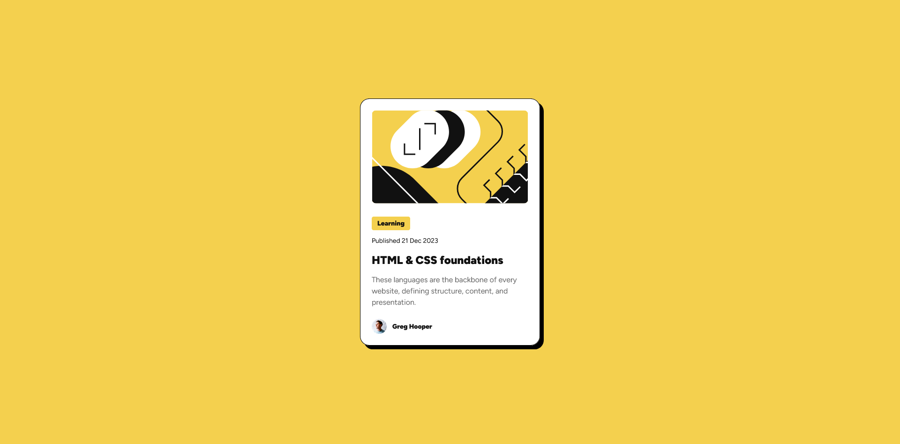

# Frontend Mentor - Blog preview card solution

This is a solution to the [Blog preview card challenge on Frontend Mentor](https://www.frontendmentor.io/challenges/blog-preview-card-ckPaj01IcS). Frontend Mentor challenges help you improve your coding skills by building realistic projects.

## Table of contents

- [Screenshot](#screenshot)
- [Links](#links)
- [Built with](#built-with)
- [What I learned](#what-i-learned)

### Screenshot

### Links

- Solution URL: [Solution URL](https://github.com/mohamed-fathy3010/FM-Blog-Preview-Card)
- Live Site URL: [Live site URL](https://mohamed-fathy3010.github.io/FM-QR/)

### Built with

- Semantic HTML5 markup
- CSS custom properties
- Flexbox
- BEM

### What I learned

I learned

- New interactions with Figma and how better transfer Figma designs to css
- Why developer prefer to wrap images with other elements.

I also gained better understanding in BEM methodology.
